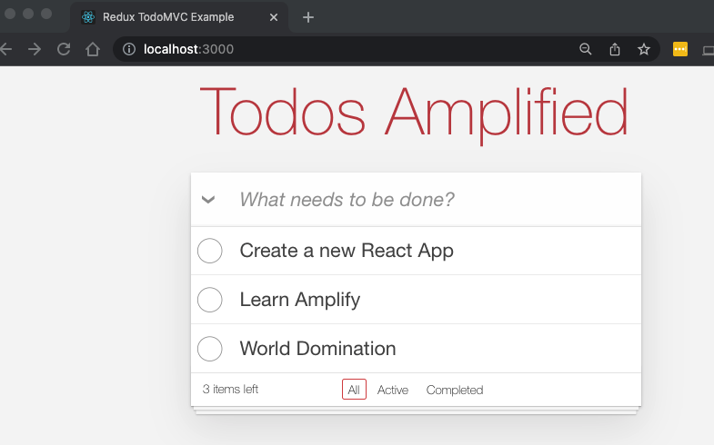

# WAR WEEK 2022 - Todo MVC Amplified

This project is a progression through building a React app and deploying it to AWS using the Amazon Amplify toolkit.

As part of the program will take a React baseline application. Add hosting, user authentication, data persistence, add a custom resource and enable a CI/CD pipeline to support ongoing changes.... in about an hour.

## Branches

Each checkpoint in the session will be captured by a branch. The branches will be as follows:

|Branch Name|Description|
|-----------|-----------|
|01-baseline-app|this is the base TODO app we will "Amplify"|
|02-add-auth|adds Cognito authentication to the app|
|03-add-persistence|adds Dynamo persistence and a GraphQL API|
|04-add-custom-resource|shows you how to override Amplify behavior with CDK|
|05-hosting|deploys the app so it is hosted in the cloud|
|06-ci-cd|adds a Continuous Integration/Continuous Deploy pipeline|

If you navigate to each branch, this README doc will progressively explain how to build each step. 

## Technologies

__Front End__

* Facebook's [React](https://reactjs.org/) using React Hooks
* [Laco](https://www.npmjs.com/package/laco): a simplified state management library, with a react wrapper
* [PropTypes](https://www.npmjs.com/package/prop-types) a runtime type checking library for React props released by Facebook
* [Classnames](https://www.npmjs.com/package/classnames) A simple JavaScript utility for conditionally joining classNames together.
* [todomvc-app-css](https://www.npmjs.com/package/todomvc-app-css) CSS for TodoMVC apps

__Back End__: 

* [Amazon Amplify](https://docs.amplify.aws/) - An opinionated toolset to speed time to market with AWS serverless apps
* [AWS Cognito](https://docs.amplify.aws/lib/auth/getting-started/q/platform/js/) for user authentication
* [AWS AppSync](https://docs.amplify.aws/lib/graphqlapi/getting-started/q/platform/js/) for managed GraphQL services
* [AWS DynamoDB](https://docs.amplify.aws/lib/datastore/getting-started/q/platform/js/) for data storage
* [AWS CloudFront](https://docs.aws.amazon.com/amplify/latest/userguide/getting-started.html) for Content Delivery Network

## How this course is intended to be used

We will start off with a React app as the baseline of our product. You will setup the Amplify toolset on your local machine, fork the repository and then begin walking through the branches (in order) in order to get to the final deliverable.

Each branch will consist of a set of incremental steps to add backend capabilities to your application, "productionizing" it as we go. At the end, you will have written a fully functioning application with CI/CD pipeline running in the AWS cloud.

Get your tools installed and account configured and let's get started!

__IMPORTANT!__
> Prior to starting this course, you should have Node/NPM (12.x +) and the AWS Amplify CLI installed. These are all very straight-forward to  setup, so they are omitted for the sake of brevity. 
>
> The documentation provides a walkthrough of how to install and configure the [AWS Amplify CLI](https://docs.amplify.aws/cli/start/install/), please have your software installed, CLI configured against your account prior to attempting this course.

### Lesson One Tasks:

1. Fork the [lesson repository](https://github.com/mgivneyjg/todo-amplify) into your own Github account. When this is complete, you should have an repository in your account that you can incrementally improve. Commit your changes to the application to `main` branch, NOT THE lesson branch. 

2. Clone the repo to your local machine. As you progress through the course, the branches are there as a reference in the event you get stuck. DO NOT COMMIT CHANGES TO THE BRANCHES. We will follow a [trunk based development](https://trunkbaseddevelopment.com/) model during the course. You want to always commit your changes to the `main` branch, unless you are directed otherwise.

3. Install the dependencies. From the command line, navigate to your project root location and run `npm install` to ensure all dependencies are pulled down and installed.

4. Start the application. From the command line, run `npm start`.

When you navigate in your browser, you should see the application up and running. This is only running locally, so other than the initial state, if you close or refresh the browser, all of your data is gone.

